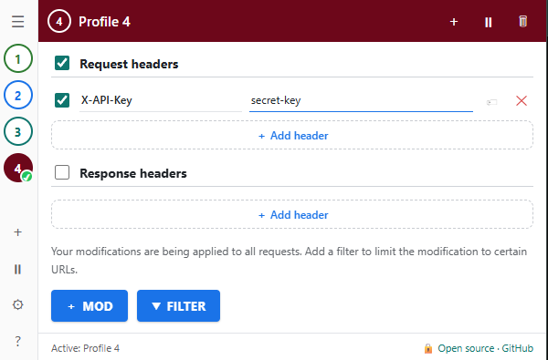

# OpenModHeader — Open-Source HTTP Header Modifier for Chrome

OpenModHeader is a lightweight, privacy-friendly Chrome extension for modifying HTTP request and response headers. It is a transparent, open-source ModHeader alternative for web developers, API testing, CORS debugging, and custom header management—with no tracking or external servers.

📄 فارسی: [README.fa.md](README.fa.md)

## Features

- Add, edit, remove, or temporarily disable request and response headers.
- Create multiple profiles and switch between header configurations quickly.
- Apply header rules only to matching URLs with filters.
- Pause all modifications with one click.
- Import and export ModHeader-compatible JSON profiles.
- Store every setting locally on your device.

## Install OpenModHeader in Chrome

1. Open `chrome://extensions`
2. Enable **Developer mode** (top-right)
3. Click **Load unpacked** and select this folder

OpenModHeader is useful for setting authorization tokens, testing APIs, debugging CORS, changing cache behavior, and managing custom HTTP headers during local development.

## Privacy and Security

The extension is designed to be fully transparent:

- No external servers, no analytics, no telemetry.
- Not minified/obfuscated — every line is readable.
- Uses Chrome's standard `declarativeNetRequest` API, so the extension never reads the content of your requests.
- All data stays in `chrome.storage.local` on your own device.

## License

MIT — [github.com/alinemone/modheader](https://github.com/alinemone/modheader)
