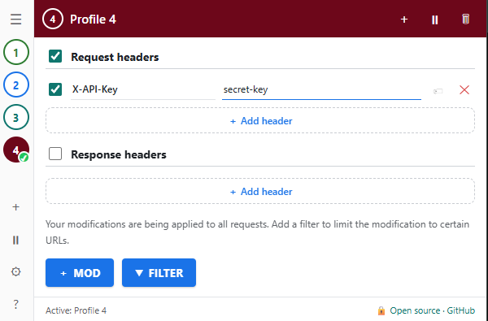

# OpenModHeader — Source-Available HTTP Header Modifier for Chrome

OpenModHeader is a lightweight, privacy-friendly Chrome extension for modifying HTTP request and response headers. It is a transparent, source-available ModHeader alternative for web developers, API testing, CORS debugging, and custom header management—with no tracking or external servers.

📄 فارسی: [README.fa.md](README.fa.md)



## Features

- Add, edit, remove, or temporarily disable request and response headers.
- Create multiple profiles and switch between header configurations quickly.
- Apply header rules only to matching URLs with filters.
- Pause all modifications with one click.
- Import and export ModHeader-compatible JSON profiles.
- Store every setting locally on your device.

## Install OpenModHeader in Chrome

Chrome only installs extensions from the Web Store or through **Load unpacked** —
no script is allowed to install one for you. The helper below does everything
except those last three clicks: it downloads the latest release, unpacks it to a
fixed location, and copies that path to your clipboard.

**macOS / Linux**

```sh
curl -fsSL https://raw.githubusercontent.com/alinemone/modheader/main/install.sh | sh
```

**Windows** — download [`install.bat`](install.bat) and double-click it.

Then, in Chrome:

1. Open `chrome://extensions`
2. Enable **Developer mode** (top-right)
3. Click **Load unpacked** and paste the path

<details>
<summary>Install manually instead</summary>

Download `openmodheader.zip` from the
[latest release](https://github.com/alinemone/modheader/releases/latest),
unzip it anywhere, then follow the same three steps and select that folder.
Running the script from a clone installs the working copy rather than the release.

</details>

OpenModHeader is useful for setting authorization tokens, testing APIs, debugging CORS, changing cache behavior, and managing custom HTTP headers during local development.

## Privacy and Security

The extension is designed to be fully transparent:

- No external servers, no analytics, no telemetry.
- Not minified/obfuscated — every line is readable.
- Uses Chrome's standard `declarativeNetRequest` API, so the extension never reads the content of your requests.
- All data stays in `chrome.storage.local` on your own device.

## License

[Personal Use License](LICENSE) — OpenModHeader is owned by Ali Alimohammadi.

**You may** use, study, test, modify, and share it for personal, noncommercial
purposes. Redistribution must keep the original ownership and copyright notice.

**You may not** sell it, monetize it, use it commercially, or present it as
your own work.

This is a *source-available* license, not an OSI-approved open-source one —
the restriction on commercial use is what makes the difference. For commercial
use, open an issue at
[github.com/alinemone/modheader](https://github.com/alinemone/modheader).
